# Informações do Projeto
Desinformação do Consumidor em Produtos Eletronicos - Grupo 1

Ciencias da Computação - PUCMG

## Participantes

> Os membros do grupo são: 
>
> - Pedro Miranda Rodrigues
> - Alexandre Augusto Niess Ferreira
> - Victor Campos Tavares
> - Caio Gomes Alcântara Glória
> - Rafael Maluf Araújo
> - Gabriel Henrique Vieira de Oliveira
> - João Vitor Silva Jardim

# Estrutura do Documento

- [Informações do Projeto](#informações-do-projeto)
  - [Participantes](#participantes)
- [Estrutura do Documento](#estrutura-do-documento)
- [Introdução](#introdução)
  - [Problema](#problema)
  - [Objetivos](#objetivos)
  - [Justificativa](#justificativa)
  - [Público-Alvo](#público-alvo)
- [Especificações do Projeto](#especificações-do-projeto)
  - [Personas e Mapas de Empatia](#personas-e-mapas-de-empatia)
  - [Histórias de Usuários](#histórias-de-usuários)
  - [Requisitos](#requisitos)
    - [Requisitos Funcionais](#requisitos-funcionais)
    - [Requisitos não Funcionais](#requisitos-não-funcionais)
  - [Restrições](#restrições)
- [Projeto de Interface](#projeto-de-interface)
  - [User Flow](#user-flow)
  - [Wireframes](#wireframes)
- [Metodologia](#metodologia)
  - [Divisão de Papéis](#divisão-de-papéis)
  - [Ferramentas](#ferramentas)
  - [Controle de Versão](#controle-de-versão)
- [**############## SPRINT 1 ACABA AQUI #############**](#-sprint-1-acaba-aqui-)
- [Projeto da Solução](#projeto-da-solução)
  - [Tecnologias Utilizadas](#tecnologias-utilizadas)
  - [Arquitetura da solução](#arquitetura-da-solução)
- [Avaliação da Aplicação](#avaliação-da-aplicação)
  - [Plano de Testes](#plano-de-testes)
  - [Ferramentas de Testes (Opcional)](#ferramentas-de-testes-opcional)
  - [Registros de Testes](#registros-de-testes)
- [Referências](#referências)

# Introdução

## Problema

Com o grande avanço tecnológico que vem ocorrendo nas últimas décadas é quase impossível não possuir um objeto que contempla as últimas tecnologias. Entretanto, o mundo do hardware ainda é uma bolha muito reclusa e pequena, com seu vocabulário robusto e a grande quantidade de informação sobre a área espalhada pela internet, a tarefa de encontrar o aparelho tecnológico ideal se torna quase impossível. É preciso a criação de uma plataforma capaz de resolver o problema de desinformação no consumo de eletrônicos
>
> Foi utilizado a plataforma Miro para desenvolvimento por meio de Design Thinking
> A partir desta foi possivel encontrar os principais aspectos que afetam o problema, organização das respostas de pesquisas realizadas em campo para a criação de Personas 
> na plataforma foi realizado um processo de brainstorm para se analizar as melhores maneiras de combater o problema previamente citado
>
> **Links Úteis**:
> - [Objetivos, Problema de pesquisa e Justificativa](https://medium.com/@versioparole/objetivos-problema-de-pesquisa-e-justificativa-c98c8233b9c3)
> - [Matriz Certezas, Suposições e Dúvidas](https://medium.com/educa%C3%A7%C3%A3o-fora-da-caixa/matriz-certezas-suposi%C3%A7%C3%B5es-e-d%C3%BAvidas-fa2263633655)
> - [Brainstorming](https://www.euax.com.br/2018/09/brainstorming/)

## Objetivos

O objetivo do trabalho é o desenvolvimento de um software capaz de acabar com a desinformação
de grande parte da população quando se trata da compra de aparelhos eletronicos,
ou seja, permitir que um comprador, a partir do uso do nosso software, seja capaz 
de escolher o melhor aparelho eletronico tendo em vista a sua necessidade de uso,
alem do mais, o usuario sera capaz de encontrar o melhor lugar para a compra do aparelho eletronico
que esse tem a necessidade.
 
> **Links Úteis**:
> - [Objetivo geral e objetivo específico: como fazer e quais verbos utilizar](https://blog.mettzer.com/diferenca-entre-objetivo-geral-e-objetivo-especifico/)

## Justificativa

Na atualidade o uso de aparelhos eletronicos é extremamente importante,
entretando saber exatamente qual aparelho comprar é de igual importancia, porem,
o vocabulario robusto exsitente no mundo de hardware e a grande numero de informação espalhada pela internet torna a compra de um aparelho
eletronico ideal quase impossivel, por esse motivo que é necessario a criação de um software capaz de resolver tal problema que pertuba a sociedade moderna.

> **Links Úteis**:
> - [Como montar a justificativa](https://guiadamonografia.com.br/como-montar-justificativa-do-tcc/)

## Público-Alvo

O publico alvo do projeto é abrangente, os usuarios são desde idosos que nunca tiverão contato com o mundo do hardware 
e querem comprar o telefone ideal para um neto, ate crianças que querem entender mais sobre os termos 
e descubrir as melhores peças para montar um computador, entrentando grande parte do publico alvo é composto 
por adultos que querem saber qual é o aparelho ideal para se usar no dia a dia, eles não querem necessariamente aprender 
tudo sobre as nuancias das novas tecnologias, mas querem saber o suficinte para não depender de terceiros
ao realizar a compra de um aparelho eletronico
 
> **Links Úteis**:
> - [Público-alvo: o que é, tipos, como definir seu público e exemplos](https://klickpages.com.br/blog/publico-alvo-o-que-e/)
> - [Qual a diferença entre público-alvo e persona?](https://rockcontent.com/blog/diferenca-publico-alvo-e-persona/)
 
# Especificações do Projeto

Nessa parte do documento sera abordado de maneira mais profunda a questão do publico alvo
tendo em vista a criação de personas para tornar tal analize mais pessoal, tambem sera abordado uma parte mais tecnica
relatando especificações tecnicas e desenvolvendo um prototipo de aplicativo, por fim é apresentado a metodologia usada para o desenvolvimento 
completo desse.

## Personas e Mapas de Empatia

Persona é a representação fictícia do seu cliente ideal. Ela é baseada em dados reais sobre comportamento e características demográficas dos seus clientes. Apresenta,
também, uma criação de suas histórias pessoais, motivações, objetivos, desafios e preocupações.
Mapa da Empatia é um material utilizado para conhecer melhor o seu cliente. A partir do mapa da empatia é possível detalhar a personalidade do cliente e compreendê-la
melhor. O mapa da empatia faz 6 perguntas para identificar seu público-alvo e assim conhecer seus sentimentos, dores e necessidades.

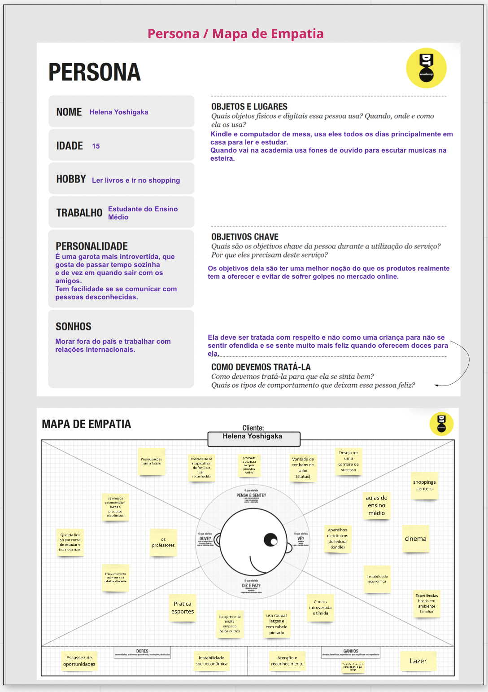
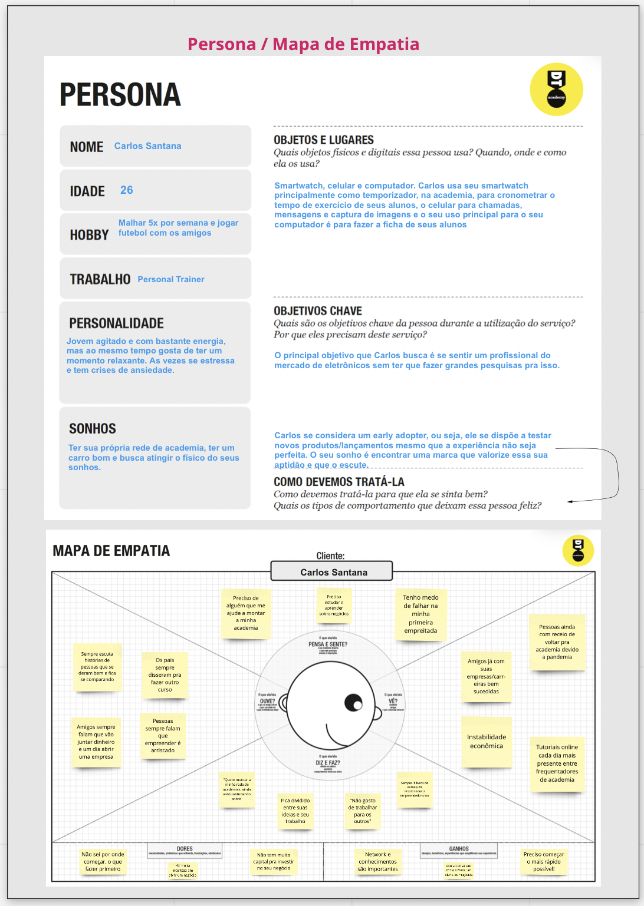
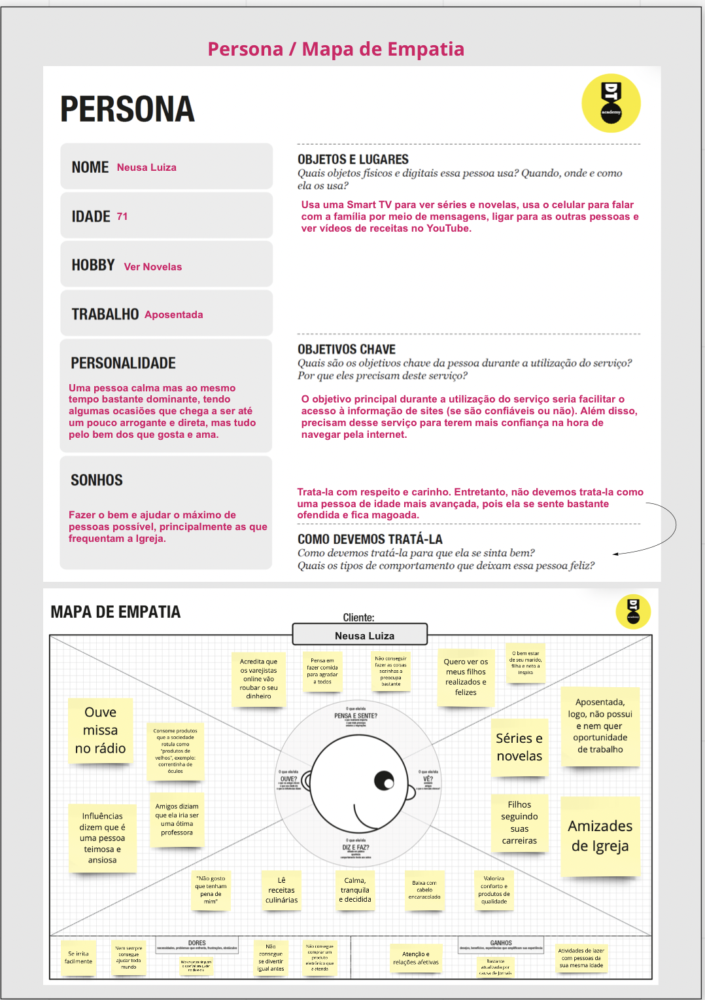

> **Links Úteis**:
> - [Persona x Público-alvo](https://flammo.com.br/blog/persona-e-publico-alvo-qual-a-diferenca/)
> - [O que é persona?](https://resultadosdigitais.com.br/blog/persona-o-que-e/)
> - [Rock Content](https://rockcontent.com/blog/personas/)
> - [Hotmart](https://blog.hotmart.com/pt-br/como-criar-persona-negocio/)
> - [Mapa de Empatia](https://resultadosdigitais.com.br/blog/mapa-da-empatia/)
> - [Como fazer um mapa de empatia - Vídeo](https://www.youtube.com/watch?v=JlKHGpVoA2Y)
> 
> 
> **Exemplo de Persona**
> 
> 
> Fonte: [Como criar uma persona para o seu negócio](https://raissaviegas.com.br/como-criar-uma-persona/)

## Histórias de Usuários

Com base na análise das personas forma identificadas as seguintes histórias de usuários:

|EU COMO... `PERSONA`| QUERO/PRECISO ... `FUNCIONALIDADE` |PARA ... `MOTIVO/VALOR`                 |
|--------------------|------------------------------------|----------------------------------------|
|Helena Yoshigaka    |Ler livros online                   |Gosto pessoal e adquirir conhecimento|
|Helena Yoshigaka    |Estudar as matérias da escola.      |Para poder passar de ano e ter conhecimento|
|Helena Yoshigaka    |Escutar músicas em um bom fone      |Para me concentrar e poder me divertir|
|Carlos Santana      |Comprar com segurança               |Para não sofrer golpes novamente| 
|Carlos Santana      |Segurança na hora de comprar online |Para não me arrepender da compra|
|Neusa Luiza         |Poder comprar sozinha online        |Me sentir mais autônoma|
|Neusa Luiza         |Conhecer sobre o produto            |Me sentir confortável e ter mais conhecimento|

> Helena Yoshigaka nasceu em Belo Horizonte MG tem 15 anos e adora ler livros pelo
> kindle e estudar pelo computador assistindo vídeos e lendo sobre assuntos de seu
> interesse. Recentemente ela queira comprar um fone para continuar escutando suas
> músicas enquanto se exercita na academia porém ela não tem o conhecimento total
> na área de tecnologia para dizer qual o melhor fone para ela exatamente fazendo
> com que o medo de acabar comprando um produto que não a satisfaça aumente, além do
> medo de sofrer um golpe online, acabam fazendo com que ela não consiga comprar
> sem que um familiar ou amigo indique o produto para ela. Por isso a ideia de um site
> que fizesse esse processo por ela foi algo que a animou bastante e a deixou
> contente.
> 
> Carlos Santana nasceu em Itaúna MG tem 26 anos e é um amante de exercícios 
> físicos, trabalha de personal trainer em uma academia da sua cidade e tem o sonho
> de abrir sua própria academia. Carlos sempre teve muito contato com a tecnologia e
> a utiliza com muita frequência em seus treinos principalmente o smartwatch que ele
> usa para medir seu desempenho além de claro um fone Bluetooth para escutar suas
> músicas enquanto se exercita. Carlos sempre teve muito de que algum de seus
> produtos estrague, pois ele não saberia por qual dentre as milhares de opções 
> trocar, além do que ele já sofreu muitos golpes virtuais e morre de medo que isso
> aconteça novamente. A ideia de um site/app que possa informar o melhor produto
> para comprar e que o evite de tomar golpes o fez saltar de alegria e ficar muito
> entusiasmado.
> 
> Neusa Luiza, uma senhora de 71 anos, onde seu principal hobby é assistir 
> programas na sua smart TV e utilizar seu telefone para conversar com sua família.
> Neusa já está aposentada e tem um boa vida, e assim como a maioria das pessoas
> da sua geração ela possui pouco conhecimento tecnológico e de internet a fazendo
> ficar a mercê de golpes virtuais que podem ocorrer, que já ocorreram por sinal a
> Dona Neusa foi comprar um produto tecnológico e acabou sofrendo um golpe do
> vendedor que percebeu que ela tinha pouco conhecimento virtual, além de já ter
> comprado um presente para seu neto que acabou não sendo o que seu netinho
> queria pois o presente não atendia as necessidades de seu neto. Quando a Sra.
> Luiza ficou sabendo do site/app que poderia auxiliá-la na horra das compras, ela
> ficou extremamente feliz e esperançosa de poder fazer as coisas sem depender de
> mais ninguém.
> 
> **Links Úteis**:
> - [Histórias de usuários com exemplos e template](https://www.atlassian.com/br/agile/project-management/user-stories)
> - [Como escrever boas histórias de usuário (User Stories)](https://medium.com/vertice/como-escrever-boas-users-stories-hist%C3%B3rias-de-usu%C3%A1rios-b29c75043fac)

## Requisitos

As tabelas que se seguem apresentam os requisitos funcionais e não funcionais que detalham o escopo do projeto.

### Requisitos Funcionais

|ID    | Descrição do Requisito  | Prioridade |
|------|-----------------------------------------|----|
|RF-001| Deve apresentar opções de compra de acordo com a quantia monetária informada pelo consumidor | MEDIO | 
|RF-002| Otimização para diferentes idades   | ALTO |
|RF-003| Deve ter uma assistente virtual para facilitar para o usuário   | BAIXO |
|RF-004| Otimização para diferentes plataformas   | MEDIO |
|RF-005| Deve apresentar as principais especificações técnicas e seus significados   | ALTO |
|RF-006| Uma aba de comparação entre os produtos   | BAIXO |
|RF-007| Deve oferecer uma funcionalidade de filtro/pesquisa para localizar aparelhos   | MEDIO |
|RF-008| Tutorial em vídeo para aprenderem a mexer no site   | BAIXO |
|RF-009| Possuir um fórum de discussão sobre os produtos   | BAIXO |
|RF-010| Permitir salvar produtos como preferidos   | MEDIO |
|RF-011| Indicar sites que sejam confiáveis e seguros   | ALTO |

### Requisitos não Funcionais

|ID     | Descrição do Requisito  |Prioridade |
|---------|---------------------------|------|
|RNF-001| O site deve ser publicado em um ambiente acessível publicamente na Internet (Repl.it, GitHub Pages, Heroku);  | ALTO | 
|RNF-002| O site deverá ser responsivo permitindo a visualização em um celular de forma adequada |  ALTO | 
|RNF-003| O site deve ter bom nível de contraste entre os elementos da tela em conformidade  |  MEDIO | 
|RNF-004| O site deve ser compatível com os principais navegadores do mercado (Google Chrome, Firefox, Microsoft Edge)  |  ALTO |
 
> **Links Úteis**:
> 
> - [O que são Requisitos Funcionais e Requisitos Não Funcionais?](https://codificar.com.br/requisitos-funcionais-nao-funcionais/)
> - [O que são requisitos funcionais e requisitos não funcionais?](https://analisederequisitos.com.br/requisitos-funcionais-e-requisitos-nao-funcionais-o-que-sao/)

## Restrições

O projeto está restrito pelos itens apresentados na tabela a seguir.

|ID| Restrição                                             |
|--|-------------------------------------------------------|
|01| O projeto não deverá deixar de fazer a vistoria nos sites para contar se eles são realmente seguros. |
|02| O site não pode deixar de atender um consumidor.        |
|03| O site não pode deixar de ter a ficha técnica do produto, avaliações e uma forma de comparar produtos. |
|04| Os integrantes não podem deixar de fazer enquetes para descobrir o que melhorar no site. |

> **Links Úteis**:
> - [O que são Requisitos Funcionais e Requisitos Não Funcionais?](https://codificar.com.br/requisitos-funcionais-nao-funcionais/)
> - [O que são requisitos funcionais e requisitos não funcionais?](https://analisederequisitos.com.br/requisitos-funcionais-e-requisitos-nao-funcionais-o-que-sao/)

# Projeto de Interface

A solução para o problema abordado pelo grupo foi criar um site/app que atendesse as demandas dos usuários. O grupo entrou em uma discussão de como isso poderia ser implementado e chegamos a conclusão que a melhor forma séria fazendo com que os usuários tivessem como informar que tipo de produtos eles querem, o “teto” monetário que eles podem gastar no produto, uma forma de localizar sites e lojas que sejam confiáveis para efetuar as compras, apresentar as principais especificações técnicas dos aparelhos, além de que o site deveria ter uma otimização por idade para que as diferentes idades pudessem usufruir de forma total do site/app.

## User Flow

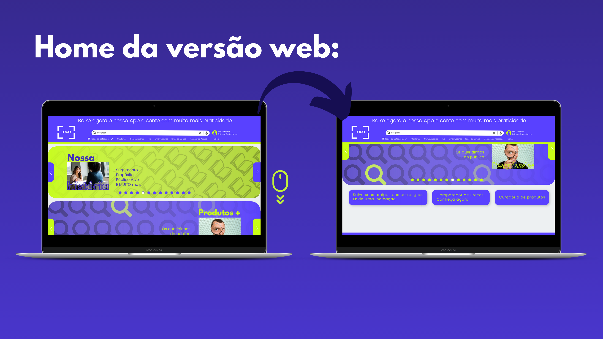
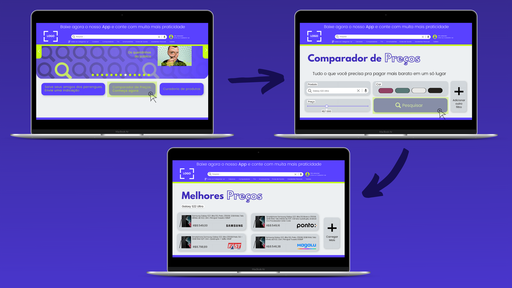
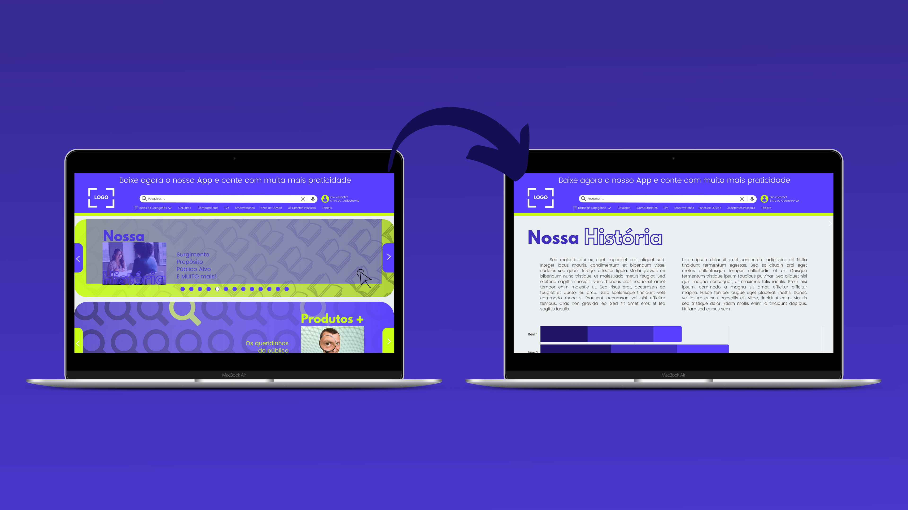
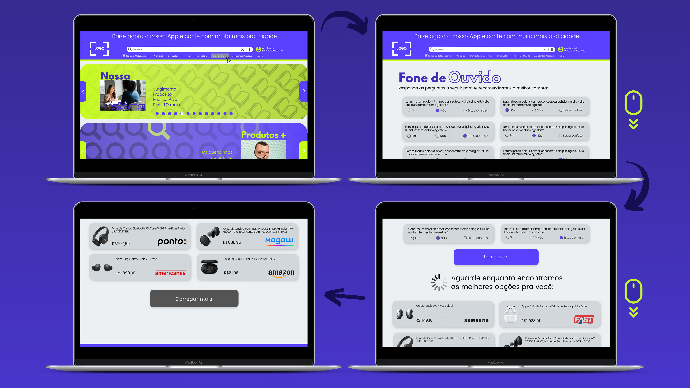
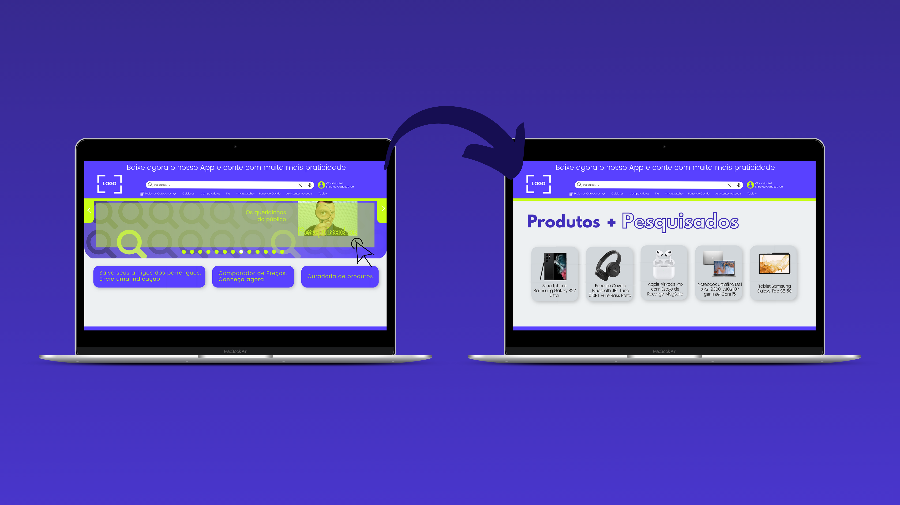

> **Links Úteis**:
> - [User Flow: O Quê É e Como Fazer?](https://medium.com/7bits/fluxo-de-usu%C3%A1rio-user-flow-o-que-%C3%A9-como-fazer-79d965872534)
> - [User Flow vs Site Maps](http://designr.com.br/sitemap-e-user-flow-quais-as-diferencas-e-quando-usar-cada-um/)
> - [Top 25 User Flow Tools & Templates for Smooth](https://www.mockplus.com/blog/post/user-flow-tools)

## Wireframes

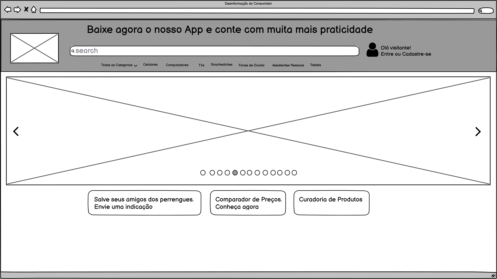
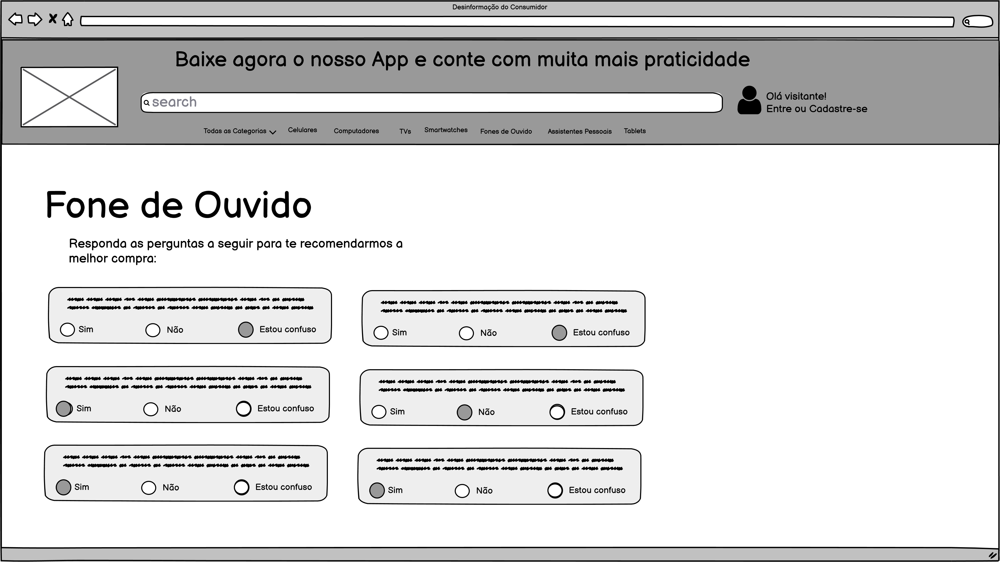
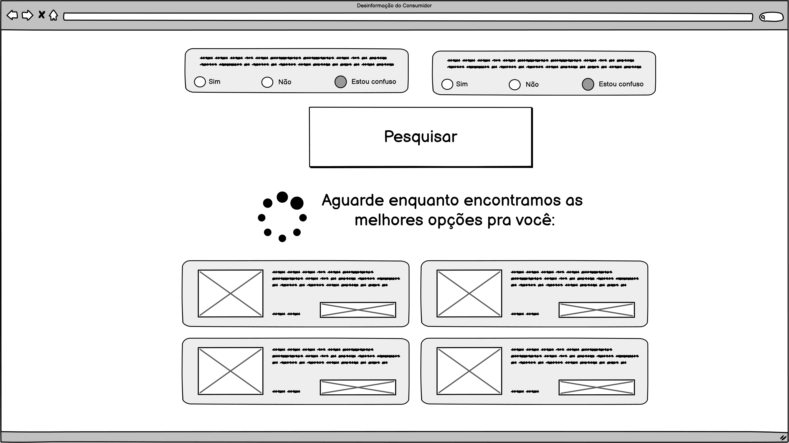
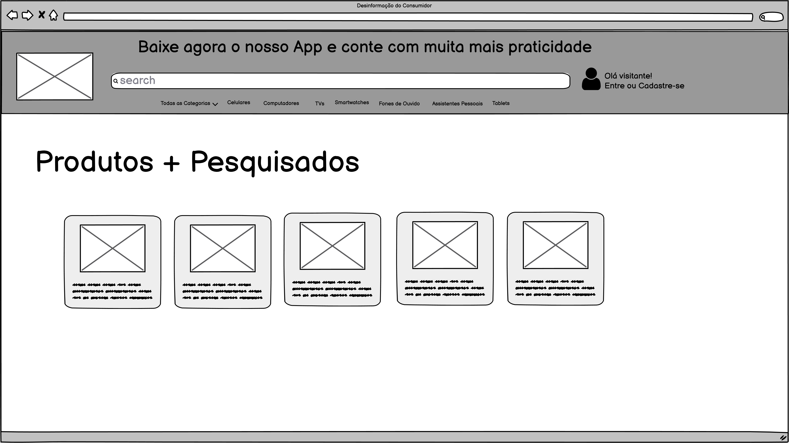
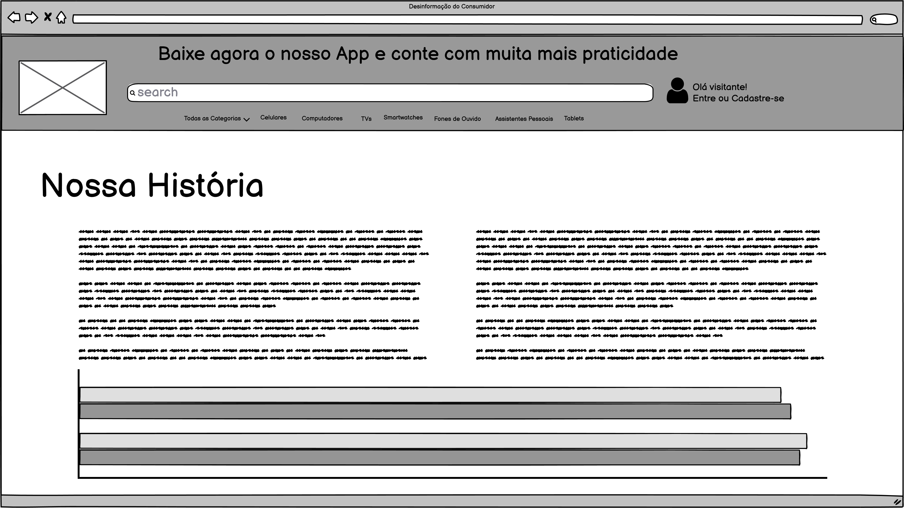
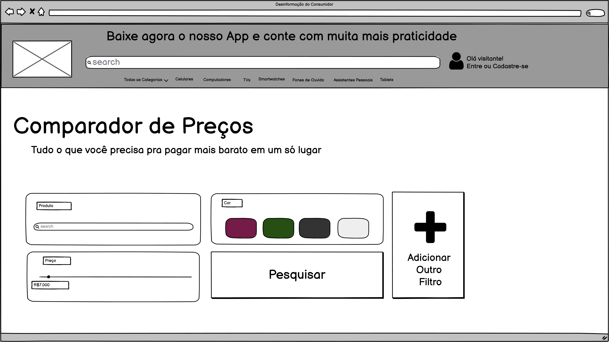
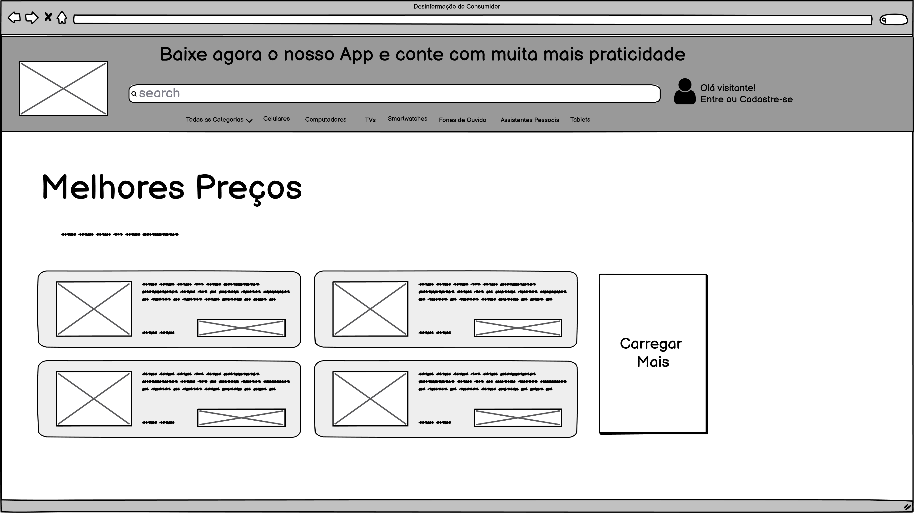

> **Links Úteis**:
> - [Ferramentas de Wireframes](https://rockcontent.com/blog/wireframes/)
> - [Figma](https://www.figma.com/)
> - [Adobe XD](https://www.adobe.com/br/products/xd.html#scroll)
> - [MarvelApp](https://marvelapp.com/developers/documentation/tutorials/)
> 

# Metodologia

No grupo foi abordado a metodologia de Desing Thinking, sendo essa baseada em um método para estimular ideação e perspicácia ao abordar problemas, relacionados a futuras aquisições de informações, análise de conhecimento e propostas de soluções.Foi tambem implementado o Framework Scrum, sendo esse um framework com o qual as pessoas podem lidar com problemas adaptativos complexos, ao mesmo tempo que entregam produtos com o mais alto valor possível de forma produtiva e criativa. Para muitos, já não é novidade. É uma das metodologias ágeis com grande participação do cliente e entregas frequentes.

> **Links Úteis**:
> - [Tutorial Trello](https://trello.com/b/8AygzjUA/tutorial-trello)
> - [Gestão ágil de projetos com o Trello](https://www.youtube.com/watch?v=1o9BOMAKBRE)
> - [Gerência de projetos - Trello com Scrum](https://www.youtube.com/watch?v=DHLA8X_ujwo)
> - [Tutorial Slack](https://slack.com/intl/en-br/)

## Divisão de Papéis
Scrum Master:
>Alexandre Augusto Niess Ferreira

Product Owner:
>Victor Campos Tavares

Equipe de Desenvolvimento:
>Pedro Miranda Rodrigues (Líder); 
>
>Alexandre Augusto Niess Ferreira; 
>
>Victor Campos Tavares; 
>
>Caio Gomes Alcântara Glória; 
>
>Rafael Maluf Araújo; 
>
>Gabriel Henrique Vieira de Oliveira; 
>
>João Vitor Silva Jardim; 

> **Links Úteis**:
> - [11 Passos Essenciais para Implantar Scrum no seu Projeto](https://mindmaster.com.br/scrum-11-passos/)
> - [Scrum em 9 minutos](https://www.youtube.com/watch?v=XfvQWnRgxG0)

## Ferramentas

| Ambiente  | Plataforma              |Link de Acesso |
|-----------|-------------------------|---------------|
|Processo de Design Thinkgin  | Miro |  https://miro.com/app/board/uXjVOB6kpg8= | 
|Repositório de código | GitHub | https://github.com/ICEI-PUC-Minas-PMGCC-TI/tiaw-pmg-cc-m-20221-desinformacao-do-consumidor | 
|Editor de Código  | VSCode |  | 
|Ferramenta de Comunicação  | Discord |  |
|Ferramenta de Diagramação | Microsoft Word |  | 

> O editor de código foi escolhido porque ele possui uma integração com o
> sistema de versão. As ferramentas de comunicação utilizadas possuem
> integração semelhante e por isso foram selecionadas. Por fim, para criar
> diagramas utilizamos essa ferramenta por melhor captar as
> necessidades da nossa solução.
> 
> **Links Úteis - Hospedagem**:
> - [Getting Started with Heroku](https://devcenter.heroku.com/start)
> - [Crie seu Site com o HostGator](https://www.hostgator.com.br/como-publicar-seu-site)
> - [GoDady](https://br.godaddy.com/how-to)
> - [GitHub Pages](https://pages.github.com/)

## Controle de Versão

> A ferramenta de controle de versão adotada no projeto foi o
> [Git](https://git-scm.com/), sendo que o [Github](https://github.com)
> foi utilizado para hospedagem do repositório `upstream`.
> 
> O projeto segue a seguinte convenção para o nome de branchs:
> 
> - `master`: versão estável já testada do software
> - `unstable`: versão já testada do software, porém instável
> - `testing`: versão em testes do software
> - `dev`: versão de desenvolvimento do software
> 
> Quanto à gerência de issues, o projeto adota a seguinte convenção para
> etiquetas:
> 
> - `bugfix`: uma funcionalidade encontra-se com problemas
> - `enhancement`: uma funcionalidade precisa ser melhorada
> - `feature`: uma nova funcionalidade precisa ser introduzida
>
> **Links Úteis**:
> - [Tutorial GitHub](https://guides.github.com/activities/hello-world/)
> - [Git e Github](https://www.youtube.com/playlist?list=PLHz_AreHm4dm7ZULPAmadvNhH6vk9oNZA)
> - [5 Git Workflows & Branching Strategy to deliver better code](https://zepel.io/blog/5-git-workflows-to-improve-development/)
>
> **Exemplo - GitHub Feature Branch Workflow**:
>
> 

# **############## SPRINT 1 ACABA AQUI #############**

## Tecnologias Utilizadas

Definimos como meta principal durante o desenvolvimento de nossa aplicação que queríamos desenvolver algo fácil de usar, justamente porque o público alvo não tem tanta experiência com produtos eletrônicos. Dessa forma, pensamos em soluções que ficariam bem implementadas tanto na versão desktop, tanto na versão mobile.

# Fluxo do Usuário:
O esquema a seguir representa os possíveis "caminhos" que o usuário pode seguir em nosso site. Todas as telas (wireframes) nele presente estarão detalhadas abaixo.

[IMAGEM]

# Wireframes:
Por ser uma aplicação bastante concisa, a quantidade de telas que o usuário tem que navegar é pequena, mas mesmo assim, é possível separar as telas em duas categorias:
* Home: A home consiste na primeira tela que o usuário verá quando acessar o site. Nela será possível realizar a seleção do tema que se deseja saber mais e também alguns fatos sobre a aplicação.
* Post: Consiste na parte de conteúdo do nosso blog (posts). Essa área, é a que o usuário vai realmente adquirir o conhecimento.
Seguem abaixo os wireframes:

[IMAGEM]
[IMAGEM]
[IMAGEM]

## Arquitetura da solução
Nessa parte, apresentamos os detalhes técnicos da aplicação criada pela equipe. 
# Diagrama de componentes:
Os componentes que fazem parte da solução são apresentados na figura que se segue:
[IMAGEM]

A solução implementada conta com os seguintes módulos:
* Navegador - Interface básica do sistema 
  - Páginas Web - Conjunto de arquivos HTML, CSS, JavaScript e imagens que implementam as funcionalidades do sistema.
  - Local Storage - armazenamento mantido no Navegador, onde são implementados bancos de dados baseados em JSON. São eles: 
-> Categorias - seções de notícias apresentadas 
-> Temas - registro de opiniões dos usuários sobre as notícias
-> Comentários - lista de notícias mantidas para leitura e acesso posterior

* Hospedagem - local na Internet onde as páginas são mantidas e acessadas pelo navegador. 

# Hospedagem:
O site utiliza a plataforma do Replit como ambiente de hospedagem do site do projeto. O site é mantido no ambiente da URL: 
https://sprint4.alexandre-augus.repl.co/index.html
A publicação do site no Replit é feita por meio de uma submissão do projeto (push) via git para o repositório remoto que se encontra no endereço: 
https://github.com/ICEI-PUC-Minas-PMGCC-TI/tiaw-pmg-cc-m-20221-desinformacao-do-consumidor

# Template do Site:
O padrão de layout a ser utilizado pelo site tem correspondência ao projeto de Interface elaborado anteriormente, conforme imagem abaixo: 
[IMAGEM]

O template criado está disponível no site https://github.com/ICEI-PUC-Minas-PMGCC-TI/tiaw-pmg-cc-m-20221-desinformacao-do-consumidor e é composto pelos seguintes layouts: 
* Tela principal
* Tela de visualização de posts

A responsividade segue o padrão do Bootstrap.

# Tela Principal:
Tela que abrange todas as visualizações iniciais do site e a lista de posts disponíveis.

[IMAGEM]
[IMAGEM]

Tela de Post:
[IMAGEM]

# Funcionalidades do Sistema (Telas):
Nesta parte são apresentadas as telas desenvolvidas para cada uma das funcionalidades do sistema. O respectivo endereço (URL) para acesso e outras orientações de acesso são apresentadas na sequência.

# Entrega Sprint 1 - Visualização de Notícias:
* Alunos responsáveis: Pedro Miranda, Victor Campos, Rafael Maluf
* Link do código: https://github.com/ICEI-PUC-Minas-PMGCC-TI/tiaw-pmg-cc-m-20221-desinformacao-do-consumidor
A tela principal da aplicação apresenta as principais aplicações de nosso site, bem como link pra acessar as demais funcionalidades do site. Um exemplo da tela é apresentada na figura abaixo:

[IMAGEM]

* Requisitos atendidos:
RF-01; RF-02; RF-04; RF-07.

* Artefatos da funcionalidade:
index.html

* Instruções de acesso:
Abra um navegador de Internet e informe a seguinte URL: https://sprint4.alexandre-augus.repl.co/index.html 
A tela inicial é apresentada assim que o link for clicado.

# Tela de Posts:
* Alunos responsáveis: Caio Gomes, Alexandre Augusto, Gabriel Henrique, João Victor Silva
* Link do código: https://github.com/ICEI-PUC-Minas-PMGCC-TI/tiaw-pmg-cc-m-20221-desinformacao-do-consumidor
A tela de posts da aplicação apresenta os conteúdos relacionados aos produtos eletrônicos. Essa tela é que o usuário entra em contato com o conhecimento que nós propomos entregar. Um exemplo dessa parte é apresentada na figura abaixo:
[IMAGEM]

* Requisitos atendidos:
RF-01; RF-02; RF-04; RF-05; RF-07; RF-11.

* Artefatos da funcionalidade:
blog.html

* Instruções de acesso:
Abra um navegador de Internet e informe a seguinte URL: https://sprint4.alexandre-augus.repl.co/index.html 
A tela de posts pode ser acessada clicando em um dos assuntos apresentados na tela inicial.

## 6. AVALIAÇÃO DA SOLUÇÃO
O processo de realização dos testes da solução desenvolvida está documentado na seção que se segue e traz os planos de testes de software e de usabilidade, na sequência, o registro dos testes realizados.

# Requisitos para realização do teste:
* Site publicado na Internet
* Navegador da Internet - Chrome, Firefox, Safari, Opera ou Edge
* Conectividade de Internet para acesso às plataformas (APIs)

Os testes funcionais a serem realizados no aplicativo são descritos nas tabelas a seguir:
[IMAGEM]
[IMAGEM]

# Registro de Testes de Software
Os resultados obtidos nos testes de software realizados são descritos na tabela a seguir:

[IMAGEM]

# Plano de Testes de Usabilidade:
O planejamento dos testes de usabilidade a serem realizados com usuários são descritos na tabela a seguir:
[IMAGEM]

# Registro de Testes de Usabilidade:
Os resultados obtidos nos testes de usabilidade realizados são descritos na tabela a seguir:
[IMAGEM]
[IMAGEM]

# Referências

> Inclua todas as referências (livros, artigos, sites, etc) utilizados
> no desenvolvimento do trabalho.
> 
> **Links Úteis**:
> - [Formato ABNT](https://www.normastecnicas.com/abnt/trabalhos-academicos/referencias/)
> - [Referências Bibliográficas da ABNT](https://comunidade.rockcontent.com/referencia-bibliografica-abnt/)

